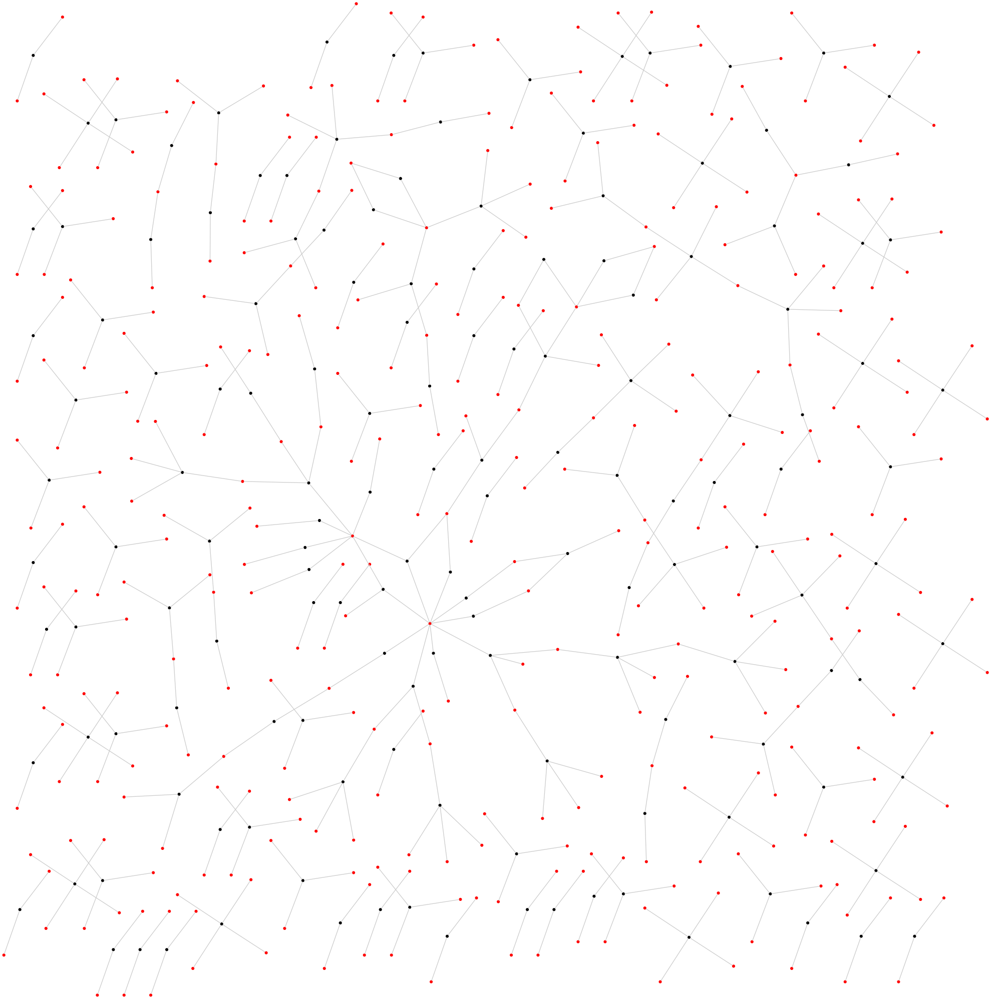

# Notes for The Curator

## Definitions

$A_n$ = *An artist, usually synonymous with $A_{cm}$*

$A_s$ = *Set of artists predicted by the model to be similar to a given artist*

$A_M$ = *All artists in the model*

$A_C$ = *All artists in a category*

$A_{CM}$ = *All artists in both category and model*

*Similar*: Artist similarity is a function of the model. The cosine similarity between two vectors is the distance to which they are similar or dissimilar.

* * *

## To-do

- Draw the dataflow for the app. Consider defining a super class, such as App or Main, that allows me to load a single file in terminal, then do `main.import()`, `main.train_model()`, `main.config('new stuff')`
- Build a dataset with only two tokens per sentence
- Look into the entropy of a token in the dataset. That is, the exhibitions can be thought of as being a corpus composed of a vocabulary. By measuring the entropy of a token, then when I export new corpuses, I can know if a token is being ascribed undue value.
- Revisit how I'm doing linear regressions. Vanessa was saying it assumes a normal distribution, which could mean I should be transforming the data. Possibly with a log transform.
- The text categories I found earlier could be added to the model to increase the number of labeled tokens.
- Maybe do an animated GIF of the Moma network forming. Frame one = exhibition 1. An `add_styled_node` fn could be used to style nodes with higher degrees differently.
- Look into the skip gram part of the algorithm. Does it display the same behavior as CBOW?
- Calculate transivity.
- Look into scraping DoME database. Login lwakeling@gmail.com:neowise. 
- Does the MET have exhibitions data? What about Frick? Perhaps also academic sources. Maybe JSTOR
- Look into if Artsy database can give examples of exhibitions. Or more movements?
- Research what other sources there are for exhibitions of modernism.
- What new data is possible to collect? I'd like to limit it to modernism. Perhaps from Impressionism to Conceptual Art. 
- When drawing a graph of similar edges, add weighted edges for more related nodes.
- Tune the model by analysing how the combinations affect repetitions in the model's iterations. Is a line of 5 artists ideal? Or could 2 be ideal? Or 10? Now that there's a way to measure the error rate, these kinds of changes are possible!
- Formalize the collection of statistics. Density, degree correlation, number of artists, categories and exhibitions, standard deviations
- Transform diacritics
- Add Tate data? No exhibitions :( Maybe more online?

* * *

## Metrics and dependencies to compare versions

How do these comparisons look? Are they in a notebook? One notebook or several? Are they perhaps markdown files? If they were markdown files, they could include the images and a table. 

What do these comparisons not look like? 

- They don't have a bunch of nonstandard file names, where I can't look back and easily trace where the data came from. 
- Each experiment isn't confused with another, ie, they don't share pickles. 
- They are not disorganized so that it makes each experiment hard to repeat the same as the others. 

**Variables**

- Skip Gram or CBOW
- Number of epocs
- Size

**Dependencies**

**Metrics**

- Total error score
- Error scores per category, where each category > N
- For each category > N:
  - A visual graph
  - Density
  - Transivity
  - Geodescic mean

## On creating a new dataset and model 21 July 2020

It would be cool to have the experiment automated to the extent that it's easy to make small changes, record the results and compare the differences.

I exported a new combinations file and ran word2vec with default settings on it. The file management was a bit clunky. The results came out slightly worse, when looking at overall error rate and P values. But two categories, Pop Art and Ab Ex, got rates down to 0.5 and the connectivity of all category graphs looked at increased. Interesting that there was an increase in nodes and edges per category graph, but that those connections present in both versions were not the same. 

I wondered what could be different. Was it the labels? Perhaps I added more labels after creating the graphs? Anyway, it's this uncertainty that makes me think the process could be more formalized. Also so that the results are in a form that are easy to compare. 


## On the applications of this project

Nicolai today asked me, what are the application of this project? I gave him an answer, because it was natural and easier than explaining that I enjoy and prefer to work on projects that don't have real-world applications. I mean, perhaps this could be useful? I highly doubt that my naive projects could matter much to CS or the art world. 

That said, I have thought about whether or not I could make a model that could take real-world exhibitions and make predictions about which artists would reach the next level, ie museum and blue chip. If you could make that sort of prediction and be successful, then ... well, that's what everyone's looking for, right? I don't think this model is the one that can make those kinds of predictions. My intuition says that it would be a graph analysis that looks for a phase transition. The place to bet would be just before the artist's network coalesces and joins a "massive component."

In terms of a next research project, that would be quite interesting. If you could find artists who went from being moderately known just before they percolated into the museum network. Given a time series dataset of exhibitions you could build a graph and watch it expand. 

## A graph problem and an NLP solution

I've heard that NLP problems can lend themselve to graph solutions. What are some examples of this? 

If this holds, then what I could be doing here is trying to solve a graph problem with an NLP solution. 

I wonder if there are other networks, similar to the artist-exhibitions graph, that could also be run through the model. 

Other small-world networks?

## On Frequency

There is an artist, $A_1$, who only has one incoming edge. That edge is from an exhibition that has M members. How many times will $A_1$ appear in the dataset? And how strongly will $A_1$ be associated to other nodes?

In a group of *n* members, with combinations r=5 $A_1$ would appear 70 times. That's not counting, the increased appearances via iteration of the context window. Based on this theoretical example, $A_1$ could add noise.

## Calculating Density

$\frac{m}{n(n-1)}$

This, from `networkx` package.

> The density is 0 for a graph without edges and 1 for a complete graph.
> The density of multigraphs can be higher than 1.

I tried it on current data, where m = 13093 and n = 13849, resulting in 6.827059655017251e-05. So, 0.000068.



It is indeed sparse!

## On an Assumption Concerning CBOW and Skip-Gram

In the first blog post on the curator, I said that the context window would split a 10-word sequence into two groups. But this presents a problem. What about sentences that are not equally divided by ten?

What I think really might be going on, is the context window slides one word forward each iteration. $I_1 = {0,1,2,3,4}$ then $I_2 = {1,2,3,4,5}$.

Update: This assumption is correct. I pulled the cbow function from the [python implementation](./notebooks/word2vec-cbow.ipynb) to inspect the iteration across sentences. My original intuition that the last artist in a show would not be associated with the first artist was correct. *But* this approach of running all combinations might be overkill. For instance, combinations of 5 might be overkill, while 5+n would be ideal.

## More Descriptive Edges

One way the graph of similar artists could be more descriptive would be to add weights to the edges. Currently many edges are undirected: arrows point in both directions. But a weight could be derived from the distance in the cosine similarity between two artists. For instance, two artists:

```python
A['similar'] = {x (0.9), y (0.8), B (0.7)}

B['similar'] = {A (0.9), p (0.5), q (0.4)}
```

`A -> B` would have a lighter edge and `B -> A` would have a heavier edge because the rank of their order.

**Calculating the Edge Weight**

**UPDATE:** The below equation for measuring rank is based on a scale of one to ten, which is basically an ordinal scale, because the distances between intervals is inconsistent. The top result of one node could have a cosim of 0.0003, while the top result of another node could have a cosim of 0.9. Therefore, it would be more accurate and descriptive to use a ratio scale based on cosim. (See journal pages 44, 46-7)

$$ weight = \frac{N - i}{N} $$


```python

import matplotlib.pyplot as plt

# in order for the last element to be > 0 index must start at 0.
edge_indices = list(range(10))
n = len(edge_indices)

weights = [(n - i) / n for i in edge_indices]
# [1.0, 0.9, 0.8, 0.7, 0.6, 0.5, 0.4, 0.3, 0.2, 0.1]

plt.plot(weights)
plt.show()

```

## The In-Group Mean vs. In-Group Error

The so-called `in-group mean` gives a measurement of possible error. Nodes outside of the in-group mean could be 1) unclassified or 2) classified as part of another art historical movement.

Currently, the mean is calculated by `similar/top_n_artists`. The median value at the moment is 0.4, where four out of ten similar arists are both in the model and in the category. Looked at from the opposite direction six out of ten artists are possible errors.

Knowing who those artists are by increasing the classification categories could diminish this error rate. This gray zone seems to be quite interesting.

Actionable items include:

- Increasing classification categories
- Look at multiple categories at once (now I'm only looking at one, Abstract Expressionism)

## Categories from Wikidata

 ```python
>>> [print(f'{c.degrees:<6} {c.id:<30s}') for c in graph.get_nodes()['Category'].values() if c.degrees > 10]
15     Post-Impressionism
12     Symbolism
46     expressionism
11     Impressionism
13     Cubism
25     surrealism
61     abstract expressionism
14     Dada
36     abstract art
14     contemporary art
30     pop art
14     minimalism
 ```